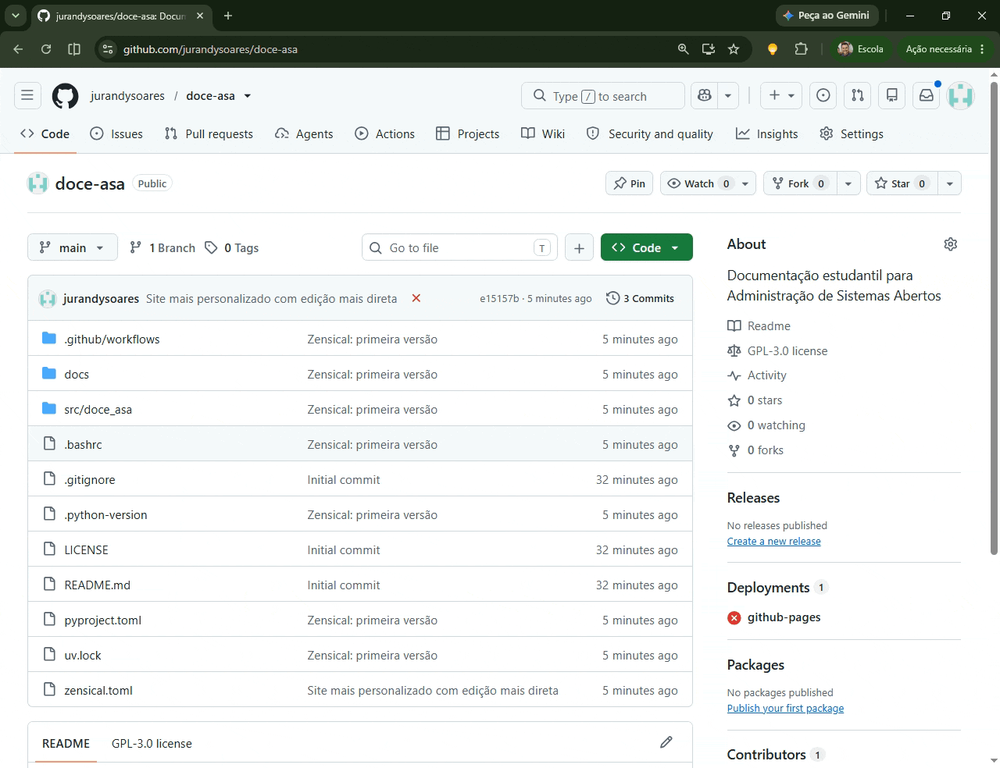
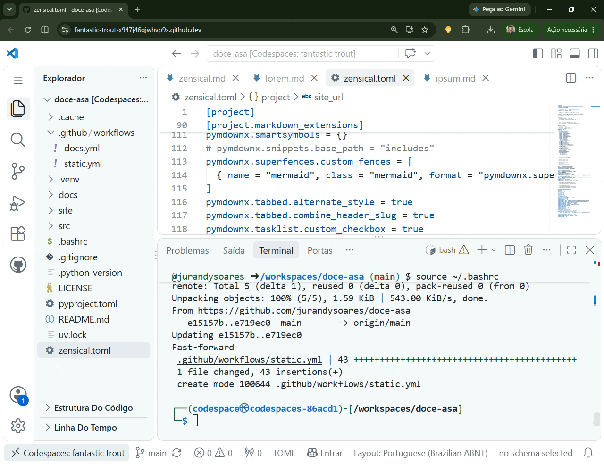

# Início

Você conhece o [Zensical](https://zensical.org/)?

Acesse sua conta do [GitHub](https://github.com/)

Vantagens: O GitHub Oferece o Codespace (VS Code na nuvem) e GitHub Pages (Espaço para publicação de seu site).


1. Crie um repo "doce-asa"

```   
   Desc.: Documentação estudantil               para ASA

   1. Visibilidade: pública
   2. Adicionar README
   3. .gitignore: Python
   4.  Licença: Pode deixar sem
```

2. Ative o GitHub Pages



3. Abrir ou criar um Codespace
   (Code -> Codespaces)
4. No Codespace, instale o uv
   (Google: uv install)

Execute:

1. `uv init`
2. `uv add zensical`
3. `uv run zensical`
4. `uv run zensical new`
(Edite os arquivos de "./docs/")
5. `uv run zensical serve`


## Ativação da página no GitHub Pages




    